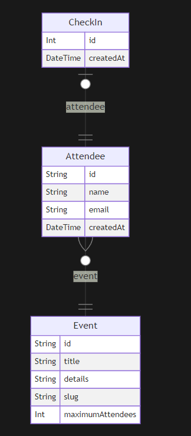

# pass.in

O pass.in é uma aplicação de gestão de participantes em eventos presenciais.

A ferramenta permite que o organizador cadastre um evento e abra uma página pública de inscrição.

Os participantes inscritos podem emitir uma credencial para check-in no dia do evento.

O sistema fará um scan da credencial do participante para permitir a entrada no evento.

<h2>Requisitos</h2>

<h3>Requisitos funcionais</h3>
- O organizador deve poder cadastrar um novo evento;
- O organizador deve poder visualizar dados de um evento;
- O organizador deve poser visualizar a lista de participantes;
- O participante deve poder se inscrever em um evento;
- O participante deve poder visualizar seu crachá de inscrição;
- O participante deve poder realizar check-in no evento;

<h3>Regras de negócio</h3>
- O participante só pode se inscrever em um evento uma única vez;
- O participante só pode se inscrever em eventos com vagas disponíveis;
- O participante só pode realizar check-in em um evento uma única vez;

<h3>Requisitos não-funcionais</h3>
- O check-in no evento será realizado através de um QRCode;

<h3>Banco de dados</h3>
Nessa aplicação vamos utilizar banco de dados relacional (HSQL DB). 
E para as migrations, utilizamos o flyway.

<h4>Esquema:</h4>

